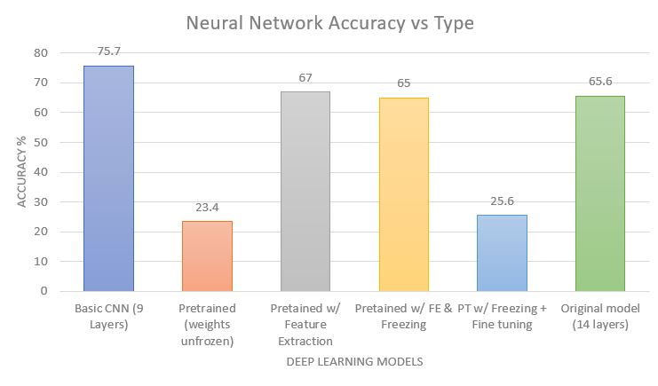
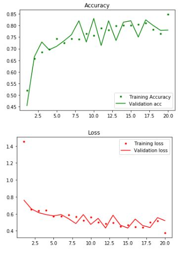
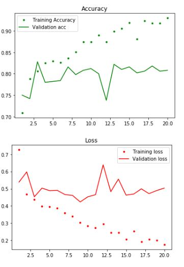

# Pnuemonia Detection via Deep Learning

## Background
Image classification and recognition is one of the most powerful applications of deep learning, and its usage is significantly important in the medical field where the slightest human error can put lives at risk. While advances in imaging technology have made it easier for medical professionls to detect certain ailments, these advances nonetheless rely on the expertise of the person at hand which is still prone to human error (e.g. due to stress or fatigue). Even doctors make mistakes.Therefore, using deep learning to mitigate human error can have a profound impact on the medical industry.

This project specifically focuses on 5,863 x-ray scans obtained from patients in Guangzhou, China. The dataset was pulled from kaggle uploaded by user Paul Mooney. The following details accompanied the dataset:

"Chest X-ray images (anterior-posterior) were selected from retrospective cohorts of pediatric patients of one to five years old from Guangzhou Women and Children’s Medical Center, Guangzhou. All chest X-ray imaging was performed as part of patients’ routine clinical care."

While many kernels on this dataset focuses on a simple binary classification between normal and pneumonia patients, this investigation will build a deep learning model to classify between three categories--normal, bacterial, and viral pneumonia. Both a self-made and a pre-trained model will be used along with optimization strategies such as feature extraction and freezing.

## Table of Contents

Pneumonia Classification via Deep Learning - Powerpoint presentation of the project

Student - Python Notebook of the project

## Project Summary

New directories were first created for viral, bacterial, and healthy patients with train, test, and validation subsets.

Different models and their respective accuracy can be seen below:

Certain models performed poorly most likely due to overfitting. This is evident when examing accuracy and loss of training and validation sets over multiple epochs.
For example, both training and validation sets had correlated accuracy with feature extraction

Meanwhile, there is a growing disparity between accuracy and loss between both sets for the weights unfrozen model:

For more infromation about each of the models, see below:

>__A.__ Basic CNN (9 layers): Alternation between Conv2D and pooling layers with 2 dense layers. Overall accuracy with test data is **75.7**%

>__B__. Pretrained Model (weights unfrozen) with 5 dense layers: Overall accuracy of **23.4%**. This is the worst attained accuracy and most likely the result of the model changing the weights of the pretrained model. 

>__C__. Pretrained Model with Feature Extraction: Overall accuracy of **67%.**

>__D__. Pretrained Model with Feature Extraction Using Freezing w/ Model Checkpoint: Accuracy of **65%** after 20 epochs. Accuracy improved to 71.5% when using the best weights.

>__E__. Pretrained Model w/ Freezing and Fine-Tuning (of last 5 layers): Accuracy of **25.6%**. This is most likely due to the model changing too many weights that were essential to the original model, which follows the pattern of model B.

>__F__. Original Model w/ 14 layers & Model Checkpoint: Accuracy of **65.6%** with best weights checkpoint. 

### Future Consideration 

    - Streamline model compilation, fit, and accuracy score with functions and use pipelines for more efficiency.
    - Test pipeline with a simple model first and compile, fit, and evaluate all other models overnight to save time.
    - Streamline randomness of keras models to have reproducible results.
    - Incorporate image augmentation to feed the model more data.

### Future Projects
    - Create a model capable of image classification for all 5 types of pneumonia
    - Try more basic models that are less computationally expensive for comparison
    - Buffer image data with additional data (e.g. from lab tests)
    - Construct additional image classification models for other tests such as fMRI and CAT. 
    - Use different pretrained models as the base such as Inception, MobileNet, Resnet, etc.
    - Explore unsupervised models for image classification
